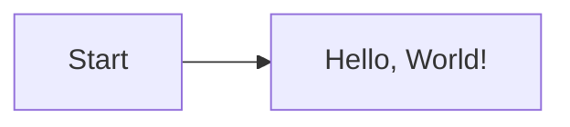

# Hello, World!

Mermaid turns text descriptions into diagrams.

```mermaid
flowchart LR
  start[Start] --> hello[Hello, World!]
```

This flowchart creates two nodes and an arrow from `Start` to `Hello, World!`.
